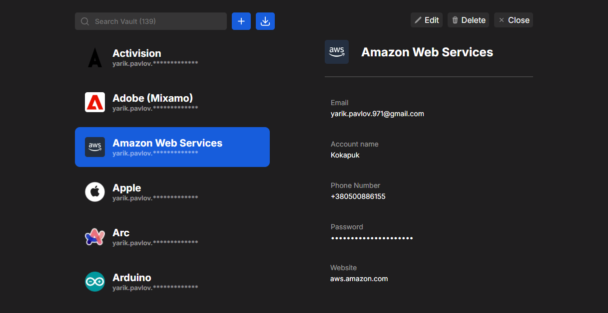

# Password Manager

- On Backend **(JavaScript)**
  - [Express](https://expressjs.com)
  - [express-validator](https://express-validator.github.io)
  - [JSON Web Tokens](https://jwt.io)
  - [MongoDB](https://www.mongodb.com) / [mongoose](https://mongoosejs.com)
- On Frontend **(TypeScript)**
  - [Next.js](https://nextjs.org)
  - [React](https://react.dev)
  - [Zustand](https://zustand-demo.pmnd.rs)
  - [React Smooth Flow](https://github.com/Kokapuk/react-smooth-flow)
  - [mongoose](https://mongoosejs.com)
  - [SCSS](https://sass-lang.com)

# 
